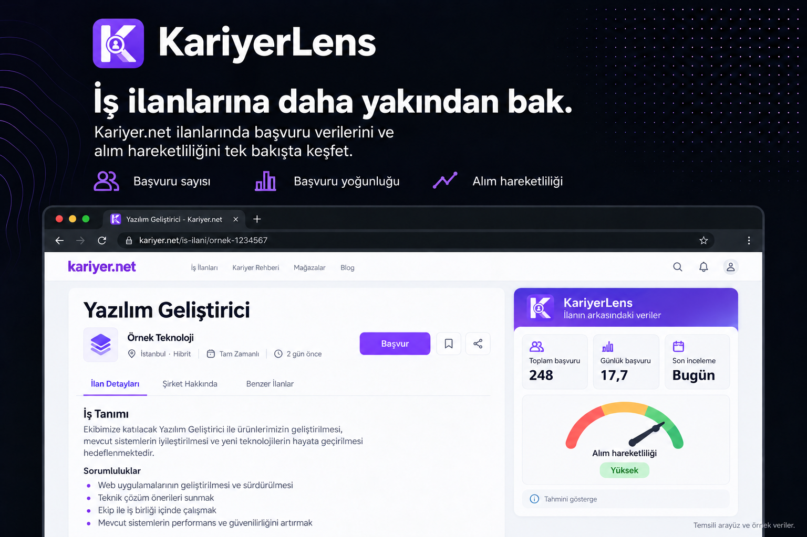

<p align="center">
  
</p>

# 🔎 KariyerLens

**İş ilanlarına daha yakından bak.**

KariyerLens, **Kariyer.net ilanlarında başvuru verilerini ve alım hareketliliğini** sayfanın içinde gösteren bir Chrome uzantısıdır. Toplam başvuru sayısını, başvuru yoğunluğunu ve şirketin son inceleme zamanını bir araya getirerek ilanı değerlendirmenize yardımcı olur.

> Proje şu anda **Manifest V3 tabanlı bir prototiptir**. Yukarıdaki tanıtım görseli temsili bir arayüz ve örnek veriler içerir.

## ✨ Özellikler

- **👥 Toplam başvuru sayısı:** API'den alınan başvuru sayısını ilanın mevcut başvuru alanında gösterir.
- **📊 Başvuru yoğunluğu:** Toplam başvuruyu ilanın açık kaldığı gün sayısına bölerek günlük başvuru ortalamasını hesaplar.
- **⏱️ Son inceleme zamanı:** Şirketin başvuruları en son ne zaman incelediğini gösterir.
- **🎯 Alım devir saati:** Son inceleme zamanı ve başvuru hızına göre alım hareketliliğini ibreli bir göstergeyle tahmin eder. Veri yetersizse bunu belirtir.
- **📅 Gerçek yayın tarihi:** İlan sayfasında yayın tarihi gizlenmiş olsa bile API'de mevcutsa bu tarihi gösterir.
- **🗓️ İlan bilgileri:** Yayın ve son başvuru tarihlerini, yayınlanma süresini ve API'deki sürüm değerini bilgi bloğunda sunar.
- **🏷️ Pozisyon etiketi:** Pozisyon adını sayfanın mevcut özellik listesine ekler.
- **🏢 Şirket istatistikleri:** Sağdaki şirket kartında takipçi ve açık iş ilanı sayılarını gösterir. Açık ilan sayısına tıklayarak şirketin ilanlarını açabilirsiniz.
- **💬 KariyerLens Asistan:** Yapay zekâ ile ilanın sağ sütununda ilanı özetler, aranan yetkinlikleri açıklar ve mülakata hazırlanmaya yardımcı olur.
- **⚡ Sayfa içinde kullanım:** Ayrı bir panel açmadan çalışır; başarılı API yanıtlarını beş dakika boyunca bellekte önbelleğe alır.

Alım hareketliliği **tahmini bir göstergedir**; şirketin kesin işe alım niyetini veya başvurunuzun sonucunu göstermez. Güncelleme sayısı için kullanılan `versionId`, API'nin sürüm değeridir.

## 📥 Kurulum

Kurulum için Node.js 22.12 veya üzeri gerekir. TypeScript kaynakları Vite ile derlenir ve oluşan `dist/` klasörü Chrome'a paketlenmemiş uzantı olarak yüklenir.

```bash
git clone https://github.com/CesurPolat/KariyerLens.git
cd KariyerLens
npm ci
npm run build
```

1. Chrome'da `chrome://extensions/` adresini açın.
2. Sağ üstteki **Geliştirici modu** seçeneğini etkinleştirin.
3. **Paketlenmemiş öğe yükle** düğmesine tıklayın.
4. Projenin içindeki **dist klasörünü** seçin.
5. Bir Kariyer.net ilan sayfasını açın veya yenileyin.

Kaynakları değiştirdikten sonra `npm run build` çalıştırın, uzantı kartındaki yenile düğmesine basın ve ilan sayfasını yenileyin. `npm run dev`, önce tip kontrolü ve temiz build yapar, ardından Vite build izleme modunu başlatır. Kaynak, HTML/CSS, manifest ve kullanılan ikon değişikliklerinde `dist/` çıktısı yenilenir; Chrome'da uzantıyı yine elle yenilemeniz gerekir. İzleme sırasında tip kontrolü için `npm run typecheck` kullanın.

Uzantı geliştirmesinde Vite dev server yerine `vite build --watch` kullanılır; Chrome, Manifest V3 betiklerini yerel `dist/` dosyalarından yükler. `vite.config.ts` içinde ayarlar sayfası, service worker ve üç içerik betiği için ayrı build ortamları tanımlanır. Ayarlar sayfasının HTML/CSS/JS bağlantılarını Vite işler; içerik betikleri klasik script biçiminde üretilir. Manifest ve kullanılan ikonlar küçük bir Vite plugin'iyle çıktıya eklenir. İzleme sırasında bir ortamın yeniden derlenmesi diğer ortamların dosyalarını silmez.

Sohbet kartı, ilan özeti/SVG gösterge ve ayarlar sayfası React + TSX component'leriyle çizilir. İçerik betikleri kartların yerini ve sayfa gezinmesini takip eder; React, kartların içeriğini ve sohbet/ayar durumlarını yönetir. Sohbet ve ilan özeti kapalı Shadow DOM içinde kendi CSS'leriyle çalışır. Sayfa yeniden çizilince kartlar yeniden yerleştirilir; ilan değişince sohbet sıfırlanır ve eski istek yanıtları uygulanmaz. Son başvuru inceleme bilgisi ilan özetindeki tarih etiketlerinin yanında tek kez gösterilir.

## 🚀 Nasıl çalışır?

### Asistan kurulumu

1. Değişikliklerden sonra `chrome://extensions/` üzerinden uzantıyı yeniden yükleyin, ardından ilan sayfasını yenileyin.
2. Uzantı simgesine veya sohbet kartındaki **Ayarlar** düğmesine tıklayın.
3. **OpenAI** veya **OpenRouter** seçin, kendi API anahtarınızı ve hesabınızın erişebildiği modelin tam kimliğini girip **Kaydet** düğmesine basın. OpenRouter kimlikleri `sağlayıcı/model` biçimindedir.
4. Sağ alttaki sohbet baloncuğuna tıklayıp sorunuzu gönderin. Panel sayfayı kaydırırken ekranda kalır; × veya Escape ile kapanır. Kapatıp açınca sohbet korunur; ilan değişince temizlenir. Enter gönderir; Shift+Enter yeni satır açar.

Her sağlayıcının anahtarı ve modeli ayrı saklanır. Anahtarı ayarlardaki silme düğmesiyle kaldırabilirsiniz. Anahtar ve model girilmeden AI isteği gönderilmez. Ayrı bir sunucu gerekmez. Sohbet, background service worker içinde LangChain agent kullanır; seçtiğiniz model **tool calling** desteklemelidir.

Asistan soruya göre iki parametresiz araç kullanabilir: `get_current_job` açık ilanın detaylarını ve başvuru verilerini, `get_current_company_stats` ise açık ilanın şirket adı, profil adresi, takipçi bilgisi, açık ilan sayısı ve ilan listesi adresini getirir. Şirket kaynağı bir JSON API değil, mevcut aynı kaynaklı profil sayfasıdır. Gösterge ve araç aynı beş dakikalık önbelleği ve devam eden isteği paylaşır. Araçlara başka ilan kimliği veya URL verilemez; eksik şirket alanları `null` döner. Her sohbet isteği yeni agent ile çalışır ve en fazla üç araç çalıştırır; araç geçmişi kalıcı saklanmaz.

Streaming'i koddan açıp kapatmak için `src/background/chat-api.ts` içindeki `CHAT_STREAMING_ENABLED` sabitini değiştirin: `true` canlı yazdırır, `false` yanıtı tek seferde gösterir ve sağlayıcı isteğinde `stream: false` kullanır. Bekleme ve tool durum göstergeleri iki modda da çalışır. Değişiklikten sonra `npm run build` çalıştırıp uzantıyı ve ilan sayfasını yenileyin.

Sohbet geçmişi yalnız açık sayfanın belleğinde tutulur; ilan değişince, temizleme düğmesine basınca veya sayfa yenilenince silinir. İsteklere son 12 mesaj eklenir. Mesajlar en fazla 4.000 karakter, ilan açıklaması en fazla 20.000 karakterdir. Yanıtlar sağlayıcıdan geldikçe parça parça Markdown olarak gösterilir: başlıklar, kalın/italik metin, listeler, alıntılar, kod blokları ve GFM tabloları desteklenir. Kullanıcı mesajları düz metin kalır. Ham HTML çalıştırılmaz; görseller yalnız açıklama metniyle gösterilir ve web bağlantıları yeni sekmede açılır. Hatalı istekler otomatik tekrarlanmaz; sorunuz yeniden gönderebilmeniz için yazı alanına geri konur. İlk metin gelene kadar hareketli durum göstergesi görünür; ilan ve şirket araçları çalışırken işlem durumu güncellenir. Sohbeti temizlemek veya ilan değiştirmek devam eden akışı iptal eder. Kesilen akışın kısmi yanıtı görünür kalır, fakat sonraki istek geçmişine eklenmez; soru tekrar göndermek için taslağa döner. Zaman aşımı 25 saniyedir.

### İlan verileri

Şirket kartındaki takipçi sayısı öncelikle ilanın “Şirket Hakkında” bölümünden alınır. Açık ilan sayısı şirket profilindeki “Tümünü Gör” alanından okunur. Şirket profilleri aynı kaynak üzerinden istenir, beş dakika bellekte önbelleğe alınır ve istekler 15 saniyede zaman aşımına uğrar. Eksik bilgiler `—` ile gösterilir; sıfır kabul edilmez. Profilde kısaltılmış takipçi sayısı varsa aynı biçimde korunur. Yeni erişim izni veya API anahtarı gerekmez.

1. İçerik betiği, ilan URL'sinden sayısal `jobId` değerini algılar.
2. Arka plan service worker'ı, Kariyer.net API'sinden ilan verilerini ister.
3. API yanıtı sade bir veri modeline dönüştürülür ve başarılı yanıtlar beş dakika önbellekte tutulur.
4. Başvuru sayısı mevcut alana yazılır; ek bilgiler `.job-features` bloğunun hemen altında gösterilir.

Uzantı, sayfanın mevcut tarih alanını değiştirmez. Ek bilgi bloğu için kendi DOM öğelerini oluşturur.

## 🔐 Veri ve erişim

İlan verileri `candidatesearchapigateway.kariyer.net` adresinden alınır. API istekleri mevcut oturumun kimlik bilgilerini içerir; erişim için normal Kariyer.net oturumunuzun ve API yetkisinin uygun olması gerekir. Projeye ait ayrı bir sunucuya veri gönderilmez.

401/403, 404, istek sınırı, CAPTCHA/bot koruması veya geçersiz yanıt durumunda ilgili istekten gelen veriler sayfaya uygulanmaz. Uzantı CAPTCHA veya PerimeterX korumasını atlatmaya çalışmaz.

Manifest, Kariyer.net sayfalarında içerik betiği çalıştırma, Kariyer.net API'sine erişim ve `storage` izni tanımlar. Mevcut API önbelleği kalıcı depolama yerine service worker belleğinde tutulur.

Asistan kullanıldığında mesajlarınız, son sohbet mesajları ve ilanın başlığı, şirketi, açıklaması, aday kriterleri ve başvuru verileri seçtiğiniz **OpenAI** (`api.openai.com`) veya **OpenRouter** (`openrouter.ai`) API'sine gönderilir. Şirket aracı çağrılırsa şirket adı, profil adresi, takipçi bilgisi, açık ilan sayısı ve ilan listesi adresi de gönderilir. Kariyer.net oturum bilgileri AI isteğine eklenmez. İlan verileri kendiliğinden AI sağlayıcısına gönderilmez; gönderim sohbet mesajınızla başlar. API kullanımı sağlayıcının tarifesine göre ücretlendirilebilir; araç kullanımında bir soru için birden fazla model isteği yapılabilir.

API anahtarları `chrome.storage.local` içinde yalnız bu bilgisayarda saklanır; bu depolama şifreli bir kasa değildir. İçerik betiklerinin depolamaya erişimi kapatılır. Anahtarlar sayfa DOM'una, sohbet kartına veya kaynak koda yazılmaz; yalnız uzantı ayarları ve arka plan service worker'ı tarafından kullanılır. Manifest bu iki AI sağlayıcısına erişim izni içerir.

### Geliştirme doğrulaması

`npm test`, derleme ve paket yapısı kontrolleriyle birlikte taklit API ve service worker testlerini çalıştırır. `npm run typecheck`, strict TypeScript kontrolünü tek başına çalıştırır.
Tarayıcı senaryoları için `npm run test:browser` çalıştırıp `http://127.0.0.1:4173/tests/browser.html` adresini açın. Bu komut önce uzantıyı derler; tarayıcı senaryoları `dist/` içindeki gerçek çıktıları kullanır. Testler gerçek sağlayıcıya istek göndermez ve API anahtarı gerektirmez.
Şirket kartı senaryoları için aynı sunucuda `http://127.0.0.1:4173/tests/company-stats.html` adresini açın; profil yanıtları taklit edilir.
React ilan özeti senaryoları: `http://127.0.0.1:4173/tests/job-summary.html`. React ayarlar senaryoları: `http://127.0.0.1:4173/tests/options.html`; depolama erişim hatası için `?storage-failure` ekleyin. Bu sayfalar derlenmiş uzantı kodunu, örnek ilan verilerini ve taklit Chrome depolamasını kullanır; gerçek API anahtarları okunmaz veya kaydedilmez.

## 🛠️ Teknoloji

Kullandığımız endpoint'lerin parametreleri, yanıt alanları ve doğrulama notları: [Kariyer.net API notları](docs/kariyer-net-api.md).

| Bileşen | Teknoloji |
| --- | --- |
| Platform | Chrome Extension · Manifest V3 |
| Dil | TypeScript · strict tip kontrolü |
| Arayüz | React · TSX component'leri · CSS |
| Derleme | npm · Vite · yerel JavaScript çıktısı |
| Arka plan | Chrome Service Worker |
| Sayfa entegrasyonu | Content Script · DOM · SVG gösterge |
| Veri kaynağı | Kariyer.net API · Fetch API |
| Önbellek | Bellek içi `Map` · 5 dakika |

## 📁 Proje yapısı

```text
KariyerLens/
├── manifest.json
├── package.json               # npm komutları ve bağımlılıklar
├── tsconfig.json              # Strict TypeScript yapılandırması
├── tsconfig.node.json         # Vite yapılandırmasının tip kontrolü
├── vite.config.ts             # Uzantı build ortamları ve statik dosyalar
├── dist/                      # Chrome'a yüklenecek çıktı (Git'e eklenmez)
├── assets/
│   ├── kariyerlens-banner.png
│   └── icons/
├── src/
│   ├── background/
│   │   ├── chat-api.ts           # OpenAI / OpenRouter istekleri
│   │   ├── kariyer-api.ts        # API isteği ve veri normalizasyonu
│   │   └── service-worker.ts    # Mesajlaşma ve önbellek
│   ├── content/
│   │   ├── chat.ts              # Shadow DOM sohbet kartı
│   │   ├── company-stats.ts     # Şirket takipçisi ve açık ilan sayısı
│   │   ├── content-script.ts   # Sayfa entegrasyonu ve göstergeler
│   │   ├── components/         # ChatCard, JobSummary, sohbet hook'u ve CSS
│   │   ├── job-insights.ts     # Tarih biçimleme ve alım hareketliliği hesabı
│   │   ├── mount-job-summary.ts # İlan özeti React kökünün yaşam döngüsü
│   │   └── globals.d.ts        # İçerik betiklerinin ortak gezinme fonksiyonları
│   ├── options/                # React OptionsApp ve ayarlar sayfası
│   └── shared/
│       ├── messages.ts         # Ortak mesaj türleri
│       └── types.ts            # İlan, sohbet, ayarlar ve sonuç tipleri
└── README.md
```

## 🔌 Yol haritası


- [ ] Chrome Web Store üzerinden dağıtım
- [ ] Farklı ilan türleri ve eksik veri senaryoları için daha geniş doğrulama
- [ ] Alım hareketliliği hesaplamasının kullanıcıya daha ayrıntılı açıklanması

## 🤝 Katkı ve destek

Hata bildirimleri ve pull request'ler için [GitHub deposunu](https://github.com/CesurPolat/KariyerLens) kullanabilirsiniz. Büyük değişiklikler için önce bir issue açarak önerinizi paylaşın. Hata bildirirken ilan URL'sini ve sorunu yeniden üretme adımlarını ekleyin; kişisel bilgilerinizi ve oturum verilerinizi paylaşmayın.

Projeyi faydalı bulduysanız GitHub'da yıldız verebilirsiniz ⭐

KariyerLens bağımsız bir projedir; Kariyer.net'in resmi uzantısı değildir.
